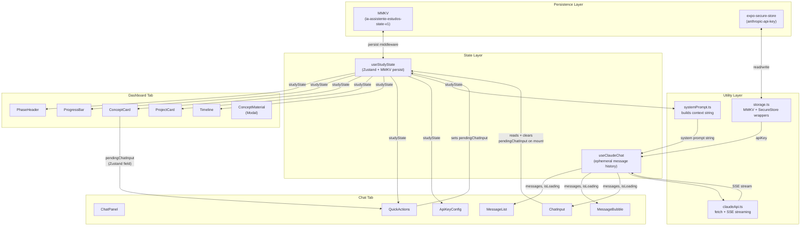

# Assistente de Estudos de IA — MVP Design

**Spec**: `.specs/features/assistente-estudos-mvp/spec.md`
**Status**: Draft

> Architecture covered by `AGENTS.md` and `STATE.md` AD-001–AD-013 is not repeated here.
> This document covers only: data flows, TypeScript interfaces, and non-obvious implementation decisions.

---

## Architecture Overview

The app has two independent data domains that compose at the Chat layer:



---

## Key Flows

### Flow 1 — Study Progression

```
User taps "MARCAR COMO LIDO"
  → useStudyState.markConceptRead(conceptId)
      ├─ If more concepts remain: increment currentConceptIndex
      └─ If last concept of phase: set mode = "project", currentProjectIndex = 0
  → Zustand persist middleware writes new state to MMKV synchronously
  → React re-renders Dashboard with new state
```

**Phase 1 special case** (two projects P2 + P3):

```
Project done in Phase 1
  → completedProjects.push(projectId)
  → If Phase 1 has remaining projects: increment currentProjectIndex
  → If all Phase 1 projects done: advance to Phase 2, mode = "concept", currentConceptIndex = 0
```

The progression algorithm in `useStudyState` must handle this by checking `curriculum[currentPhaseId].projects.length > currentProjectIndex + 1` before advancing the phase.

### Flow 2 — Chat with Context

```
User taps Send (or sends via QuickAction)
  → useClaudeChat.sendMessage(userText)
      1. Append user message to local messages[]
      2. Build API payload:
           system: systemPrompt.buildPrompt(studyState)
           messages: last 20 from messages[] (truncate oldest first)
      3. Call claudeApi.streamMessage(apiKey, payload)
      4. Append empty assistant message to messages[]
      5. For each SSE delta chunk:
           update assistant message content in-place
           trigger re-render (MessageBubble streams progressively)
      6. On stream end: mark isLoading = false, re-enable send
```

### Flow 3 — Quick Action → Chat Pre-fill

Cross-tab communication is a unique challenge with Expo Router tab navigation (tabs preserve their own state). Chosen approach: **`pendingChatInput` field in `useStudyState`** (Zustand is global, not scoped to a tab).

```
User taps "Explique este conceito" (Dashboard tab)
  → useStudyState.setPendingChatInput("Me explique o conceito atual: [title]")
  → Expo Router router.push("/(tabs)/chat")
  → Chat tab mounts / focuses
  → ChatInput useEffect reads pendingChatInput from useStudyState
  → Sets local input value, calls useStudyState.clearPendingChatInput()
```

`pendingChatInput` is **not persisted** to MMKV — it's transient navigation state. The Zustand store will use `partialize` to exclude it from the persist middleware.

### Flow 4 — SSE Streaming in React Native

React Native's `fetch` supports readable streams via `response.body.getReader()` in Expo SDK 52+ (Hermes engine). Anthropic's streaming API returns `text/event-stream`.

```typescript
// In claudeApi.ts
const response = await fetch("https://api.anthropic.com/v1/messages", {
  method: "POST",
  headers: {
    "x-api-key": apiKey,
    "anthropic-version": "2023-06-01",
    "content-type": "application/json",
  },
  body: JSON.stringify({ ...payload, stream: true }),
});

const reader = response.body!.getReader();
const decoder = new TextDecoder();

while (true) {
  const { done, value } = await reader.read();
  if (done) break;
  const chunk = decoder.decode(value);
  // Parse SSE lines: "data: {...}"
  // Extract delta.text from content_block_delta events
  onChunk(delta);
}
```

**Risk**: `response.body.getReader()` availability depends on Hermes version shipped with Expo SDK 52. If unavailable, fallback: poll with non-streaming request (set `stream: false`, await full response). Flag this in the implementation task.

---

## Data Models

These are the TypeScript interfaces to define in `types/index.ts`. They are the contract between all layers.

### Curriculum Types (static, read-only)

```typescript
interface Concept {
  id: string
  title: string
  whyItMatters: string
  whatToLearn: string
  howToLearn: string
  resources: string[]
  pitfalls: string[]
  readingTimeMinutes: number
}

interface Project {
  id: string
  title: string
  description: string
  steps: Array<{ title: string; description: string }>
  readinessCriteria: string[]
}

interface Phase {
  id: string
  name: string
  objective: string
  weekRange: [number, number]  // e.g. [1, 2] for weeks 1-2
  color: string                // hex, used by Timeline
  concepts: Concept[]
  projects: Project[]
}
```

### State Types (persisted via MMKV)

```typescript
interface StudyState {
  currentPhaseId: string
  currentConceptIndex: number
  currentProjectIndex: number
  mode: 'concept' | 'project'
  startDate: number            // Date.now() at first load
  completedConcepts: string[]  // concept IDs
  completedProjects: string[]  // project IDs
  // key: projectId, value: { stepIndex: checked }
  projectStepStates: Record<string, Record<number, boolean>>
  // key: projectId, value: { criteriaIndex: checked }
  projectCriteriaStates: Record<string, Record<number, boolean>>
  // transient — excluded from MMKV persist via partialize
  pendingChatInput: string
}
```

### Actions (useStudyState public interface)

```typescript
interface StudyStateActions {
  markConceptRead: (conceptId: string) => void
  markProjectDone: (projectId: string, force?: boolean) => void
  updateStepState: (projectId: string, stepIndex: number, checked: boolean) => void
  updateCriteriaState: (projectId: string, criteriaIndex: number, checked: boolean) => void
  setPendingChatInput: (text: string) => void
  clearPendingChatInput: () => void
  // computed selectors (not mutations)
  currentWeek: () => number
  currentPhase: () => Phase
  currentConcept: () => Concept | null
  currentProject: () => Project | null
}
```

### Chat Types (ephemeral, not persisted)

```typescript
interface Message {
  id: string
  role: 'user' | 'assistant'
  content: string
  isStreaming?: boolean  // true while SSE stream is active for this message
}

interface ChatError {
  code: 401 | 429 | 500 | 502 | 503 | 'network'
  message: string
}
```

---

## Component Interfaces

Only components with non-trivial props or cross-component contracts are listed.

### `ConceptCard`
```typescript
interface ConceptCardProps {
  concept: Concept
  conceptIndex: number       // 1-based for display
  totalConcepts: number
  onMarkRead: () => void
  onShowMaterial: () => void
  onAskClaude: () => void    // triggers pendingChatInput + tab nav
}
```

### `ProjectCard`
```typescript
interface ProjectCardProps {
  project: Project
  projectId: string
  stepStates: Record<number, boolean>
  criteriaStates: Record<number, boolean>
  onStepToggle: (index: number, checked: boolean) => void
  onCriteriaToggle: (index: number, checked: boolean) => void
  onMarkDone: () => void
}
```

### `MessageBubble`
```typescript
interface MessageBubbleProps {
  message: Message
  // Renders content via react-native-markdown-display for assistant messages
  // Plain Text for user messages
}
```

### `QuickActions`
```typescript
interface QuickActionsProps {
  currentConcept: Concept | null
  currentProject: Project | null
  stepStates: Record<number, boolean>
  onAction: (prefill: string) => void  // sets pendingChatInput + navigates
  // hidden when apiKey is absent (ESTD-40)
  visible: boolean
}
```

---

## Error Handling Strategy

| Error Scenario | Handling | User Sees |
|---|---|---|
| API 401 | Caught in `useClaudeChat`, set `chatError` | "API key inválida. Verifique a configuração." (inline, no history clear) |
| API 429 | Caught in `useClaudeChat` | "Limite de requisições atingido. Aguarde um momento." |
| API 500/502/503 | Caught in `useClaudeChat` | "Erro nos servidores da Anthropic. Tente novamente." |
| Network failure | Caught in fetch try/catch | "Sem conexão com a internet." |
| Stream interrupted mid-flight | Caught in reader loop | Partial response displayed + error indicator appended |
| MMKV storage full | Caught in persist middleware | "Não foi possível salvar o progresso. Espaço de armazenamento insuficiente." |
| Invalid JSON in MMKV | Caught in Zustand rehydrate | Reset to defaults, `console.warn` |
| `currentConceptIndex` OOB | Caught in `useStudyState` hydration | Reset to index 0, `console.warn` |

---

## Risks & Concerns

| Concern | Impact | Mitigation |
|---|---|---|
| `response.body.getReader()` availability in React Native / Hermes (Expo SDK 52) | Streaming SSE may not work; chat falls back to full-response mode | T7 (claudeApi.ts) must test streaming at runtime with `typeof response.body?.getReader === 'function'`; fall back to non-streaming if unavailable |
| NativeWind v4 className on non-core RN components | Styles silently ignored on third-party components | Only apply `className` to RN core primitives (View, Text, Pressable, TextInput, ScrollView, FlatList); use inline `style` for third-party components |
| `react-native-mmkv` requires native build (`expo run:ios/android`) | MMKV will NOT work in Expo Go (only in dev builds) | Document in AGENTS.md; all local dev must use `npx expo run:ios` or `npx expo run:android` |
| SSE text/event-stream parsing edge cases (multi-line events, heartbeat pings) | Partial or missed delta chunks | claudeApi.ts must handle chunked UTF-8 decode, buffer incomplete lines, and skip `event: ping` lines |
| Expo Router tab state preservation on `router.push` | Chat tab may re-mount on navigation, clearing `pendingChatInput` | Use `useEffect` with `useIsFocused()` (Expo Router) instead of `onMount` to read `pendingChatInput` |

---

## Tech Decisions

| Decision | Choice | Rationale |
|---|---|---|
| Cross-tab prefill mechanism | Zustand `pendingChatInput` field (excluded from persist) | Simpler than navigation params; Zustand is already global; avoids Expo Router deep-linking complexity |
| Streaming fallback strategy | Runtime detect `response.body.getReader`; if absent, use non-streaming | Prevents crash on older Hermes; degraded UX is acceptable for MVP |
| `markProjectDone` with unchecked criteria | Returns `{ needsConfirm: true }` to caller; UI owns the dialog | Keeps hook testable; dialog state stays in component |
| Zustand `partialize` for MMKV | Exclude `pendingChatInput` from serialized state | It's transient navigation state — persisting it would pre-fill input on cold restart |
